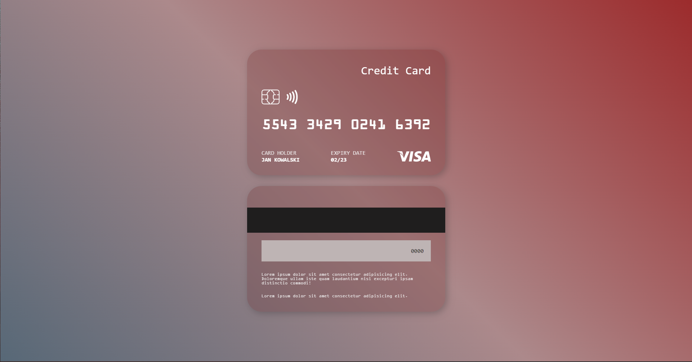

### Screenshot




```js
const front = document.querySelector(".content-one")
const back = document.querySelector(".content-two")
const cardClick = document.querySelector(".card-front")
const cardClickBack = document.querySelector(".card-back")
cardClick.addEventListener("click", () => {
    back.classList.remove("hidden")
    front.classList.add("hidden")
})
cardClickBack.addEventListener("click", () => {
    front.classList.remove("hidden")
    back.classList.add("hidden")
})
```
